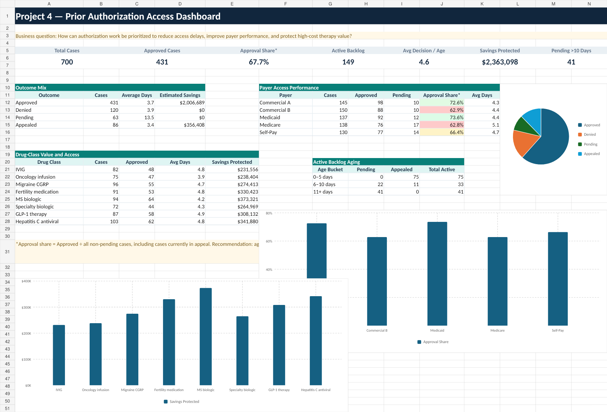

# Project 4 — Prior Authorization Access Dashboard

## Business question

How can authorization work be prioritized to reduce access delays, improve
payer performance, and protect high-cost therapy value?

## Dataset

- 700 synthetic, PHI-free authorization cases
- Five payers
- Eight drug classes
- Approved, denied, pending, and appealed outcomes
- Case age and simulated savings fields

## Executive KPIs

| KPI | Result |
| --- | ---: |
| Total cases | 700 |
| Approved cases | 431 |
| Approval share | 67.7% |
| Active backlog | 149 |
| Average decision / active age | 4.6 days |
| Simulated savings protected | $2,363,098 |
| Pending over 10 days | 41 |

Approval share is calculated as approved cases divided by all non-pending
cases, including cases currently in appeal.

## Methodology

1. Defined approved, denied, pending, and appealed outcomes.
2. Separated closed-case decision time from active-case aging.
3. Segmented access performance by payer, drug class, outcome, and age bucket.
4. Combined access urgency with simulated financial impact.
5. Reconciled dashboard results to all 700 source records.

## Key findings

- Approved cases represent 67.7% of all non-pending cases.
- The active backlog contains 149 pending or appealed cases.
- There are 41 pending cases older than 10 days.
- Simulated savings protected total approximately $2.36M.
- Approval performance varies materially by payer.

## Recommendations

- Create 0–5, 6–10, and 11+ day workqueues with escalating ownership.
- Develop payer- and drug-class-specific documentation checklists.
- Measure approval share, appeal overturns, time to therapy, and abandonment
  separately.
- Prioritize cases using clinical urgency, age, and potential financial impact.

## Files

- `dashboard.png` — prior-authorization dashboard image
- `prior_authorizations.csv` — complete synthetic case dataset
- `prior_authorization_analysis.sql` — PostgreSQL access and payer analysis

## Limitations

Estimated savings is simulated portfolio value, not guaranteed revenue or
patient savings. The sample does not contain clinical urgency, documentation
completeness, abandonment, or final appeal disposition.

