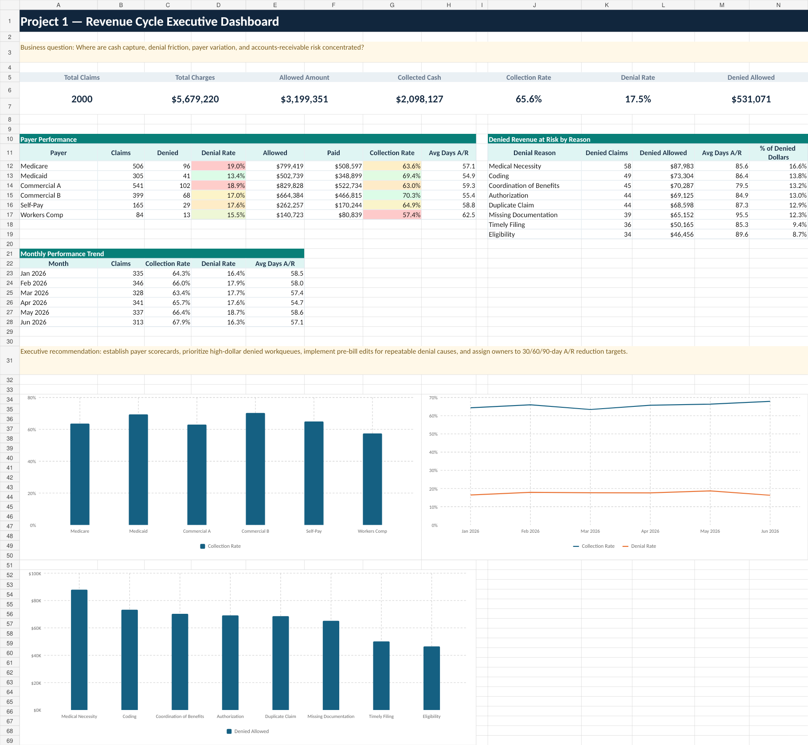

# Project 1 — Revenue Cycle Executive Dashboard

**[Open the interactive case study](https://ccreyn04.github.io/healthcare-analytics-portfolio/projects/revenue-cycle.html)**

## Business question

Where are cash capture, denial friction, payer variation, and
accounts-receivable risk concentrated?

## Dataset

- 2,000 synthetic, PHI-free claims
- Six payers
- Six service lines
- Five care locations
- Six months of service dates

## Executive KPIs

| KPI | Result |
| --- | ---: |
| Total claims | 2,000 |
| Total charges | $5,679,220 |
| Allowed amount | $3,199,351 |
| Collected cash | $2,098,127 |
| Collection rate | 65.6% |
| Denied claims | 349 |
| Denial rate | 17.5% |
| Denied allowed value | $531,071 |

## Methodology

1. Defined financial and operational KPIs before analysis.
2. Validated record count, dates, categories, and numeric fields.
3. Segmented performance by payer, service line, location, claim status, and
   month.
4. Separated volume, rate, dollars, and aging so priorities were not based on
   counts alone.
5. Reconciled all dashboard totals to the row-level source.

## Key findings

- The sample contains $5.68M in charges and $3.20M in allowed value.
- Overall collection performance is 65.6% against allowed amount.
- The 349 denied claims represent $531,071 in denied allowed value.
- Payer-level collection, denial, and A/R performance varies materially.

## Recommendations

- Build a weekly payer scorecard combining collection rate, denial rate,
  denied dollars, and A/R.
- Prioritize high-dollar denied workqueues rather than claim volume alone.
- Implement pre-bill edits for repeatable authorization, eligibility,
  documentation, and coding defects.
- Assign owners and measurable targets for denial prevention and aging
  reduction.

## Files

- `dashboard.png` — executive dashboard image
- `revenue_cycle_claims.csv` — complete synthetic source dataset
- `revenue_cycle_analysis.sql` — PostgreSQL KPI, payer, and trend analysis

## Limitations

The dataset is synthetic and does not represent a real healthcare organization
or payer contract. Allowed and paid values are simulated and are not guaranteed
recoveries.
