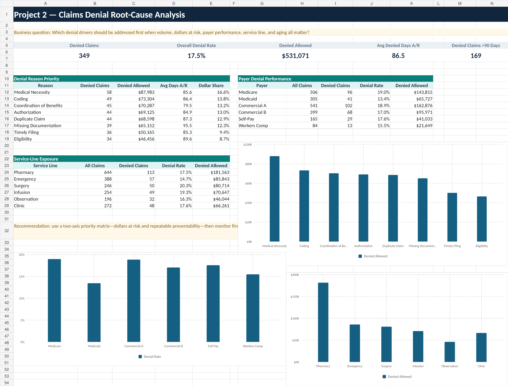

# Project 2 — Claims Denial Root-Cause Analysis

**[Open the interactive case study](https://ccreyn04.github.io/healthcare-analytics-portfolio/projects/claims-denials.html)**

## Business question

Which denial drivers should be addressed first when volume, dollars at risk,
payer performance, service line, and aging all matter?

## Dataset

The analysis uses the complete 2,000-claim source as the denominator and
isolates 349 denied claims for root-cause analysis.

## Executive KPIs

| KPI | Result |
| --- | ---: |
| Denied claims | 349 |
| Overall denial rate | 17.5% |
| Denied allowed value | $531,071 |
| Average denied A/R | 86.5 days |
| Denied claims over 90 days | 169 |
| Highest-dollar reason | Medical Necessity — $87,983 |

## Methodology

1. Retained the full claim population as the denominator for denial rates.
2. Reconciled denial counts and dollars to the revenue-cycle project.
3. Ranked root causes using both frequency and denied allowed value.
4. Compared payer and service-line exposure while retaining A/R context.
5. Mapped repeatable causes to practical prevention ownership.

## Key findings

- Denials represent 17.5% of the complete sample.
- Medical Necessity is the largest denial category by allowed dollars.
- Denied claims average 86.5 days in A/R.
- There are 169 denied claims older than 90 days.
- Pharmacy contributes 113 denied claims, connecting frontline workflows with
  revenue integrity.

## Recommendations

- Use a two-axis priority matrix: denied dollars at risk and repeatable
  preventability.
- Develop playbooks for medical necessity, coding, authorization, coordination
  of benefits, and documentation.
- Separate first-pass prevention metrics from back-end recovery.
- Review aged denials weekly with named owners and disposition reasons.

## Files

- `dashboard.png` — denial-analysis dashboard image
- `revenue_cycle_claims.csv` — complete source population
- `claims_denial_analysis.sql` — denominator-aware PostgreSQL analysis

## Limitations

The synthetic sample does not contain contract language, payer policy text,
appeal outcomes, or actual recovery dates. Denied allowed value measures
simulated exposure, not guaranteed collectible cash.
