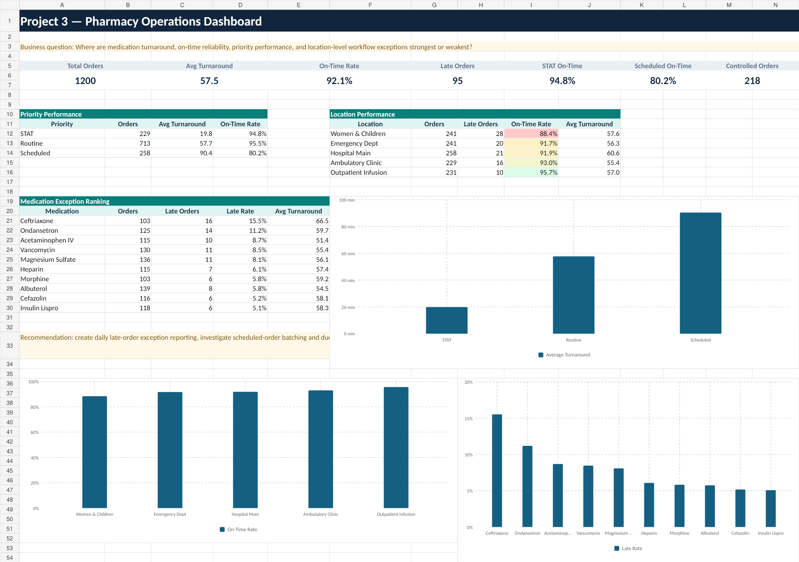

# Project 3 — Pharmacy Operations Dashboard

**[Open the interactive case study](https://ccreyn04.github.io/healthcare-analytics-portfolio/projects/pharmacy-operations.html)**

## Business question

Where are medication turnaround, on-time reliability, priority performance,
and location-level workflow exceptions strongest or weakest?

## Dataset

- 1,200 synthetic, PHI-free medication orders
- Five care locations
- Three priority levels
- Ten medications
- Controlled-substance and on-time indicators

## Executive KPIs

| KPI | Result |
| --- | ---: |
| Total orders | 1,200 |
| Average turnaround | 57.5 minutes |
| On-time rate | 92.1% |
| Late orders | 95 |
| STAT on-time rate | 94.8% |
| Scheduled on-time rate | 80.2% |
| Controlled orders | 218 |

## Methodology

1. Defined priority-specific operational measures before analysis.
2. Validated timestamps, locations, priorities, medications, and completion
   flags.
3. Compared volume, turnaround, on-time rate, and late-order count.
4. Segmented exceptions by priority, location, medication, and
   controlled-substance status.
5. Separated scheduled-order opportunities from STAT reliability.

## Key findings

- Overall on-time performance is 92.1%.
- STAT orders achieve 94.8% on-time performance.
- Scheduled orders have the weakest on-time rate at 80.2%.
- Women & Children has the lowest location-level on-time rate.
- Outpatient Infusion has the strongest location-level performance.

## Recommendations

- Create a daily late-order exception report by location, priority, and
  medication.
- Review scheduled-order batching, due-time logic, and staffing overlap.
- Standardize turnaround definitions across order entry, pharmacy processing,
  and delivery.
- Set location-specific targets and document recurring root causes.

## Files

- `dashboard.png` — pharmacy-operations dashboard image
- `pharmacy_operations.csv` — complete synthetic order dataset
- `pharmacy_operations_analysis.sql` — PostgreSQL KPI and segmentation queries

## Limitations

The dataset does not contain staffing, acuity, clinical urgency, preparation
complexity, delivery route, or real Epic timestamps. Simulated on-time targets
should not be interpreted as clinical standards.
